# AI_FAPRO Migration Guide

## Environment Specifications

- **Node.js**: v16.x (Recommended for Nuxt 2)
- **Framework**: Nuxt.js v2.15.8
- **Styling**: Tailwind CSS v3.x
- **Language**: JavaScript / Vue 2

## Mandatory Frontend Rules (The 15 Rules)

1. **No Internal Styles**: All styles in `assets/css/`.
2. **No Bootstrap**: Pure Tailwind + BEM.
3. **CSS Hierarchy**: `assets/css/[PageName]/[ComponentName]/[Filename].css`.
4. **Functional CSS Granularity**: Use Korean comments.
5. **Tailwind via @apply**: Extract to BEM classes.
6. **Single Class Principle**: One BEM class per tag.
7. **Mandatory Libraries**: Modal-Vanilla, Animate.css, SwiperJS, D3.js.
8. **Purpose-Driven Naming**: Intent over form.
9. **Structural Granularity**: 150-line limit per component.
10. **Korean Documentation**: All comments in Korean.
11. **Guide Page & Visual Tree**: Automated mapping.
12. **Project Specification Log**: Tracking versions/decisions.
13. **Unique Filename Requirement**: Descriptive prefixes.
14. **Smart Search & UX**: Autocomplete enforcement.
15. **External Library Styling Control**: Styles in `assets/css/`.

## NPM Packages Used

- `nuxt`: ^2.15.8
- `tailwindcss`: ^3.3.7
- `modal-vanilla`: ^0.13.0
- `vue-feather-icons`: ^5.1.0 (Icon Library)
- `echarts`: ^5.5.1 (Data Visualization)
- `autocompleter`: ^9.3.2 (Smart Search)
- `animate.css`: (Styling)

## Route Visual Tree (Rule 11)

### [/customers] - 고객 관리 시스템

```mermaid
graph TD
    Page["pages/customers.vue"] --> CSS_Page["assets/css/pages/customers/CustomersPage.css"]

    Page --> Comp_Upload["components/customers/CustomerUploadArea.vue"]
    Comp_Upload --> CSS_Upload["assets/css/pages/customers/CustomerUploadArea.css"]

    Page --> Comp_Search["components/customers/CustomerAiSearch.vue"]
    Comp_Search --> CSS_Search["assets/css/pages/customers/CustomerAiSearch.css"]
    Comp_Search --> Lib_Autocomplete["Lib: Autocomplete (Rule 14)"]

    Page --> Comp_Table["components/customers/CustomerListTable.vue"]
    Comp_Table --> CSS_Table["assets/css/pages/customers/CustomerListTable.css"]

    Page --> Comp_Detail["components/customers/CustomerDetailModal.vue"]
    Comp_Detail --> CSS_Detail["assets/css/pages/customers/CustomerDetailModal.css"]
    Comp_Detail --> Lib_ModalV1["Lib: Modal-Vanilla (Rule 7)"]
    Comp_Detail --> Lib_Animate1["Lib: Animate.css (Rule 7)"]

    Page --> Comp_Holdings["components/customers/CustomerHoldingsModal.vue"]
    Comp_Holdings --> CSS_Holdings["assets/css/pages/customers/CustomerHoldingsModal.css"]
    Comp_Holdings --> Lib_ModalV2["Lib: Modal-Vanilla (Rule 7)"]
    Comp_Holdings --> Lib_Animate2["Lib: Animate.css (Rule 7)"]

    Page --> MockData["utils/customerMockData.js"]
```

## Directory Structure

- `assets/css/`: Centralized CSS storage.
- `components/`: Modularized Vue components.
- `pages/`: Nuxt based routing.
- `utils/`: Mock data and utility functions.
- `layouts/`: Application layouts.
